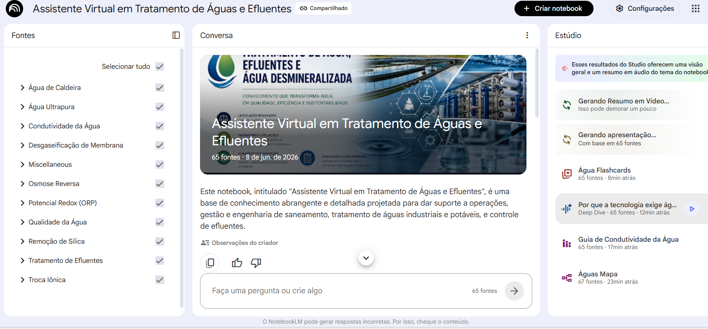

# notebooklm-water-treatment-assistant
# 💧 Assistente Inteligente para Tratamento de Águas e Efluentes

## 📖 Sobre o Projeto

Este projeto utiliza o Google NotebookLM para criar uma base de conhecimento especializada em tratamento de águas e efluentes.

O objetivo é auxiliar operadores, técnicos, estudantes e engenheiros na consulta rápida de informações técnicas, interpretação de parâmetros de qualidade da água, identificação de possíveis causas de desvios operacionais e consulta à legislação ambiental brasileira.

O tratamento de água e efluentes envolve o monitoramento de diversos parâmetros físico-químicos e microbiológicos. Muitas vezes, compreender a relação entre esses parâmetros e consultar rapidamente a legislação aplicável pode ser um desafio para estudantes e profissionais da área.

A inteligência do Notebook foi construída a partir de normas oficiais, legislações ambientais, materiais técnicos e referências da área de saneamento e tratamento de águas industriais.

---

## 🎯 Objetivos

- Centralizar informações técnicas sobre qualidade de águas e efluentes.
- Facilitar a consulta de parâmetros operacionais e laboratoriais.
- Relacionar parâmetros físico-químicos e suas influências nos processos.
- Apoiar a identificação de causas de não conformidades.
- Disponibilizar informações atualizadas sobre padrões legais brasileiros.
- Auxiliar no aprendizado sobre operações de tratamento de águas e efluentes.

---

## 🔬 Temas Abordados

### Água para Consumo Humano
- Potabilidade
- Turbidez
- Cor aparente
- Cloro residual
- pH
- Fluoreto
- Coliformes

### Tratamento de Efluentes
- DBO
- DQO
- Sólidos Suspensos Totais (SST)
- Óleos e Graxas
- Nitrogênio
- Fósforo
- Eficiência de tratamento

### Água Desmineralizada
- Condutividade
- Resistividade
- Sílica
- Dureza
- Sódio
- Troca iônica
- Osmose reversa
- Leito misto

### Sistemas Industriais
- Caldeiras
- Vapor
- Condensado
- Corrosão
- Incrustação
- Controle operacional

---

## ⚙️ Funcionalidades

O NotebookLM foi projetado para responder perguntas como:

- Qual a relação entre pH e alcalinidade?
- Como a turbidez influencia o consumo de cloro?
- Quais parâmetros podem indicar falha na coagulação?
- O que pode causar aumento da condutividade em água desmineralizada?
- Como interpretar resultados de DBO e DQO?
- Quais são os limites legais para lançamento de efluentes?
- Como identificar possíveis causas de corrosão em sistemas de vapor?
---

---

## 📚 Fontes Utilizadas

### Legislação Brasileira
- Portaria GM/MS nº 888/2021
- Resolução CONAMA nº 357/2005
- Resolução CONAMA nº 430/2011

### Referências Técnicas
- Manuais da CETESB
- Materiais da Agência Nacional de Águas (ANA)
- Publicações sobre tratamento de água e efluentes
- Guias de operação de sistemas de desmineralização
- Apostilas e materiais técnicos de saneamento

---

## 🏭 Público-Alvo

- Operadores de ETA e ETE
- Técnicos de laboratório
- Engenheiros químicos
- Engenheiros ambientais
- Engenheiros sanitaristas
- Estudantes das áreas de saneamento e tratamento de águas
- Profissionais da indústria que trabalham com água de processo

---

## 💡 Diferencial

Além de consultar valores e limites legais, o NotebookLM foi estruturado para explicar as relações entre os parâmetros de qualidade da água e auxiliar na investigação de possíveis causas de desvios operacionais, funcionando como um assistente técnico especializado em tratamento de águas e efluentes.
